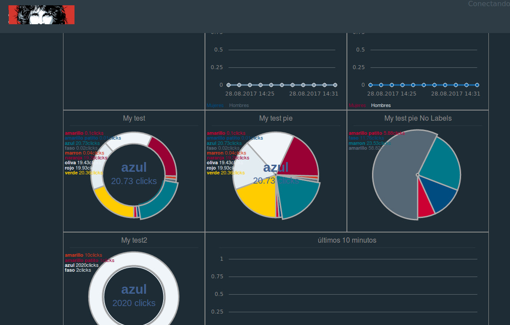

# MORRISON BOARD

## What is **Morrison board**?

**Morrison board** is a board to show info on your screen.

Basically it takes info from a database (i.e. a datawarehouse DB) and show visual indicators on the screen.

You can show info with bars, stackedbars, lines, areas, donuts, pies or texts.

Each one of this is called *widget*. They are set on the backend, so the frontend just take a *json* object from the backend and draw what is needed.

You can add widgets adding items on the backend array that stores them (indeed you can modifiy this code to get the widgets from a database).

## Attention

This is a work in progress, so it may have (indeed it HAS) errors.

Please, be consructive on your critisism. Thanks.

## Prerequisites

**Morrison board** is constructed on top of **Morris** (which uses **Raphael**) and **Bee Rest**.

## Install

  - Copy files
  - Modify board/js/config.js
  - Set your backend
  - Use it.

## Step by Step

### Copy files

Well, just copy files to your web server.

### Modify board/js/config.js

Here we have two lines to modify. They set two variables.

  - morris_url: is the API Rest's url from which get data for board.
  - morris_poll_timeout: is the time (ms) to set *setTimeout* function to call server.

### Set your backend

For detailed info on **Bee Rest** see the *README* there.

Here you will set
Basically **Morrison board** adds this files inside *vendor* dir:
